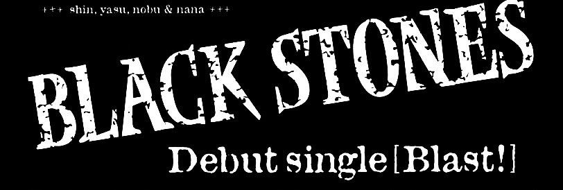
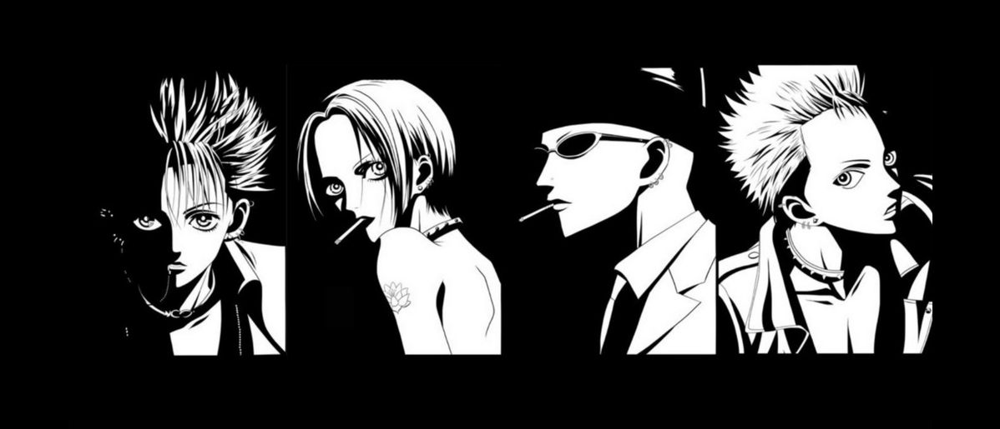
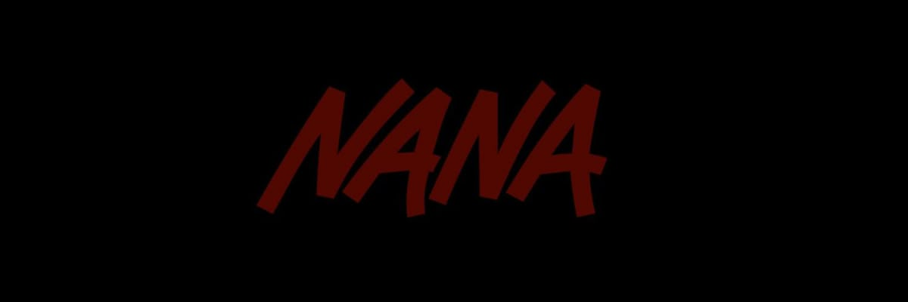

markdown

Copy code
<p align="center">
  <picture>
    <source media="(prefers-color-scheme: dark)" srcset="assets/blackstones-banner.jpg">
    
  </picture>
</p>

<div align="center">
  
  <br><br>
</div>

<div align="center">
  # EZEQUIEL 
  <br><br>
  
  
  
  **No future without risk.**
</div>

### 🛠️ 
<div align="center" style="margin: 1em 0;">
  
  
  
  
  
  
</div>

---

## 🎸

"Não é sobre o que você quer ser, é sobre o que você faz para chegar lá."
– Nana Osaki

🔥 PERFORMANCE STATS
<div align="center">   </div> <div align="center">   </div>
🎧 Currently Jamming
<div align="center">  </div>
🐍 Snake Game
<div align="center">  </div>
🎤 BLAST CREW
<div align="center">  <div style="margin-top: 20px;">  </div> </div> <div align="center" style="background: linear-gradient(45deg, #1a1a1a, #2d1b69); padding: 25px; border-radius: 15px; border: 1px solid #FF1493; margin: 20px 0;"> <h3 style="color: #FF1493; margin: 0 0 10px 0;">🖤 BLAST MODE: **ON** 🖤</h3> <p style="color: white; font-size: 16px;"><i>"If you don't take risks, you can't create a future."</i></p> </div>
<div align="center">   </div> <div align="center" style="margin-top: 20px;"> <a href="https://github.com/EzequielMSys">  </a> <a href="https://linkedin.com/in/EzequielMSys">  </a> </div> ```